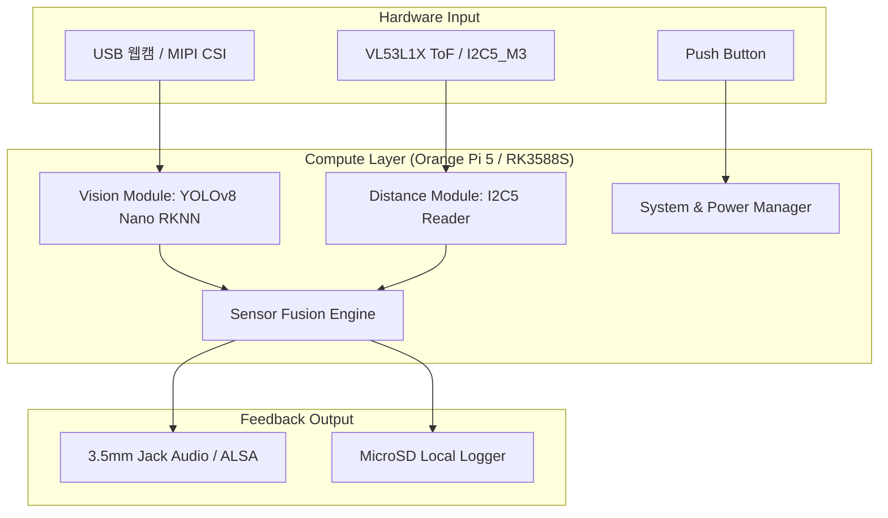
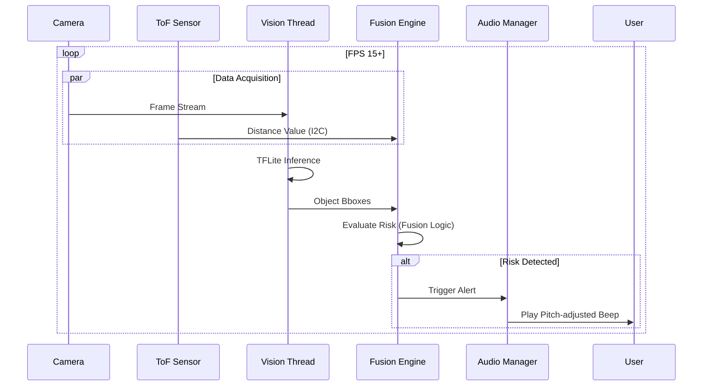

# Technical Requirements Document (TRD): RasEyes

## 1. Executive Summary & Context

**Vision:**
RasEyes는 시각장애인이 보행 중 겪는 상단(가슴~머리 높이) 사각지대의 충돌 위험을 해결하기 위한 웨어러블 엣지 디바이스입니다. 본 문서는 Orange Pi 5 (4GB, RK3588S+NPU 6TOPS) 기반의 하드웨어와 RKNN 기반의 비전 AI 모델, ToF 센서를 결합하여 완전한 오프라인 환경에서 실시간(Low Latency)으로 위험을 탐지하고 피드백을 제공하는 시스템의 기술적 명세를 정의합니다.

**Goals vs Non-Goals:**
* **Goals:** On-device 100% 오프라인 구동, 전체 시스템 지연 시간 < 500ms, 센서 퓨전(Camera + ToF)을 통한 인식 정확도 확보.
* **Non-Goals:** GPS 기반 길 안내, 클라우드 서버 연동, GUI 기반 사용자 인터페이스.

---

## 2. System Architecture & Flow

### 2.1 High-Level Architecture
전체 시스템은 입력 센서, 데이터 처리 엔진, 그리고 알림 출력 계층으로 구성됩니다.

### 2.2 Sequence Diagram: Detection Pipeline
지연 시간을 최소화하기 위해 영상 캡처와 추론, 센서 데이터 읽기를 병렬로 처리합니다.

---

## 3. Functional Requirements

| Req ID | Feature | Tech Specs | Success Metrics | Fallback |
| :--- | :--- | :--- | :--- | :--- |
| **FR-01** | **Headless Boot** | `systemd` 서비스 자동 실행 및 오디오 큐 송출. | 부팅 후 가동까지 **< 45초**. | 부저 에러 패턴 출력. |
| **FR-02** | **Vision Inference** | YOLOv8 Nano (RKNN) NPU 가속 구동. | 추론 지연 시간 **< 60ms**. | ToF 단독 모드 전환. |
| **FR-03** | **Sensor Fusion** | BBox 영역 내 ToF 거리 매핑 및 필터링. | 오탐지 시간당 **< 5회**. | 이동 평균 필터 적용. |
| **FR-04** | **Audio Feedback** | 거리에 따른 비프음 주기(Period) 가변 제어. | 이벤트 발생 시 출력 **< 100ms**. | 보드 내장 부저 출력. |

---

## 4. Data & API Design

### 4.1 Local Data Schema (CSV Logging)
성능 분석과 디버깅을 위해 MicroSD에 다음 데이터를 기록합니다.
* `timestamp`: ISO 8601 (ms 단위)
* `cpu_temp`: °C (스로틀링 모니터링)
* `fps`: Integer (실시간 성능 기록)
* `tof_distance_cm`: 정밀 거리 데이터
* `alert_triggered`: Boolean (경고 발생 여부)

---

## 5. Non-Functional Requirements

* **Performance:** End-to-End Latency P99 < 500ms. CPU 평균 사용률 70% 미만 유지.
* **Thermal:** Active Cooler를 통한 발열 제어. 80°C 도달 시 FPS를 낮추는 Graceful Degradation 적용.
* **Security:** 고해상도 이미지는 저장하거나 전송하지 않음 (Privacy by Design). SSH Key 기반 관리자 접속만 허용.

---

## 6. Risks & Infrastructure

* **발열 스로틀링:** AI 연산 부하로 인한 성능 저하 위험. 5V Fan 헤더 직결 쿨러 + 케이스 통풍구 설계로 대응. 80°C 초과 시 FPS 자동 하향(Graceful Degradation).
* **RKNN 모델 변환:** YOLOv8 ONNX → .rknn 변환은 PC에서 rknn-toolkit2로 사전 수행. 보드에서는 rknnlite2로 추론만 실행.
* **오디오 HAL 안정성:** ALSA 드라이버 초기화 실패 시 재시도 로직 필요. ES8388 코덱 설정 이슈 발생 가능.
* **배포 전략:** GitHub 원격 저장소를 통한 코드 업데이트 및 Ansible 기반의 환경 구성 자동화.
